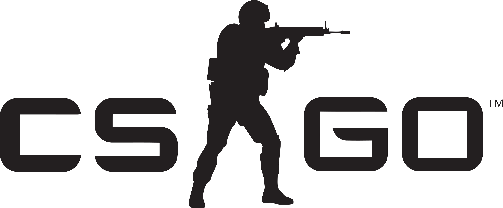

# CSGO Managing Server Cheatsheet  
Cheatsheet of most commonly used commands in private servers  

<!--    -->

    

#### # Commands for Managing Matches  (Server Side)

| Description  	| Command  	|
|---	        |---	    |
| Set gravity | sm_rcon sv_gravity 800 |
| Sets team limits| sm_rcon mp_limitteams 0 |
| Set freeze time | sm_rcon mp_freezetime 4  |
| End warmup  	| sm_rcon mp_warmup_end |
| Set round time to 60 secs	| sm_rcon mp_roundtime 60 |
| Restart game in 0 seconds| sm_rcon mp_restartgame 0 |
| Autobalance teams| sm_rcon mp_autoteambalance 0 |
| Headshot only | mp_damage_headshot_only 1 |
| Change map to workshop id  	| sm_rcon host_workshop_map map_id|
| Teammates will be enemies | sm_rcon mp_teammates_are_enemies 1 |

 
    
#### # Player Commands Used For Practice

| Description | Command|
|---|---|
| God mode | god |
| Fly and immortality | noclip |
| Firstperson view | firstperson |
| Thirdperson view | thirdperson |
| Show bullet impacts | sv_showimpacts 1 |
| Infinite ammo | sv_infinite_ammo 1 |
| Turn on cheats | sm_rcon sv_cheats 1 |
| Wallhack | r_drawothermodels 2 |
| Bullet impact time | sv_showimpacts_time 5 |
